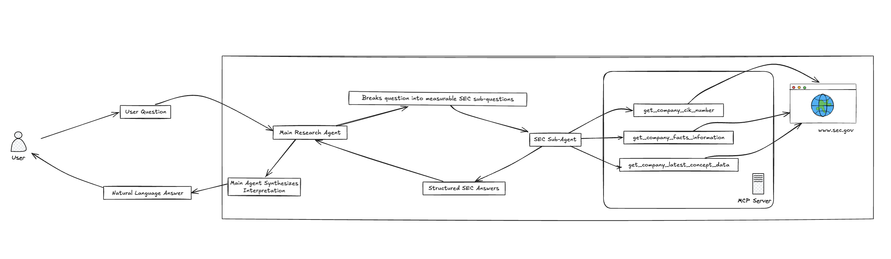

# FinSight
Your intelligent companion for financial research — precise insights from SEC filings at your fingertips

---

**FinSight** is an AI-powered financial research agent that helps users explore public company performance using official SEC filings. Powered by a multi-agent system, it translates complex questions into structured sub-queries and delivers fact-based insights using real-time data from the [SEC EDGAR XBRL API](https://www.sec.gov/edgar/sec-api-documentation).

---

## 🚀 Key Features

- 🔍 **Natural Language Financial Research**  
  Ask high-level questions like:  
  _“Are there signs of financial distress in Nvidia?”_ or  
  _“Is Apple increasing its investment in R&D?”_

- 🧠 **Multi-Agent Architecture**  
  - **Main Research Agent** understands intent, decomposes questions, and orchestrates sub-tasks.
  - **SEC Filings Expert** agent handles structured queries using SEC’s XBRL database.

- 🧰 **Built-In Tools**
  - `get_company_cik_number`: Lookup CIK from company name.
  - `get_company_facts_information`: List all financial facts available for a company.
  - `get_company_latest_concept_data`: Retrieve time-series values for key financial metrics.

- 🔗 **Data Source**  
  Live integration with the SEC’s public [XBRL company concept API](https://data.sec.gov/api/xbrl/companyconcept/).

- 📖 **Explainable Results**  
  Each response includes specific fiscal year, form type (10-K/10-Q), and filing dates.

---

## 🧠 How It Works



---

## 💼 Example Questions You Can Ask

- “What is Nvidia’s free cash flow trend?”
- “Does Apple show signs of financial distress?”
- “How has Tesla’s R&D investment changed in the last 5 years?”
- “What is the most recent earnings per share reported by Amazon?”

---

## 📁 Project Structure

```
├── agent.py                # Entry point for agents and runner
├── prompt.py              # Instructions for root and sub-agents
├── tools/                 # Custom tool implementations
├── logs/agent.log         # Timestamped logs of queries and events
├── .env                   # Contains SEC_AGENT_MODEL and ROOT_AGENT_MODEL
└── README.md              # This file
```

---

## 📦 Tech Stack

- 🧩 **Google ADK**
- 🧠 **Gemini LLMs**
- 📄 **SEC XBRL API** (`data.sec.gov`)
- 🔌 **Multi-agent orchestration**
- 📜 **Python async, logging, environment-driven config**

---

## 📈 Future Improvements

- Add support for multi-company comparisons
- Integrate with vector database for long-form filing summarization
- Include industry benchmarks for richer insights
- Stream responses in real-time via web UI or chat interface

---

## 🛡️ Disclaimer

FinSight retrieves only **public data from the SEC** and does not provide investment advice or trading recommendations.

---

## 🧑‍💻 Author

**Sai Rohit Uddagiri**  
Data Engineer & AI Agent Developer  
[LinkedIn](https://www.linkedin.com/in/sairohituddagiri/) | [GitHub](https://github.com/Rohituddagiri)
