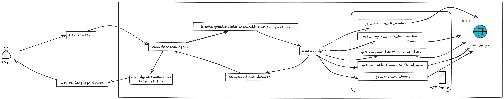
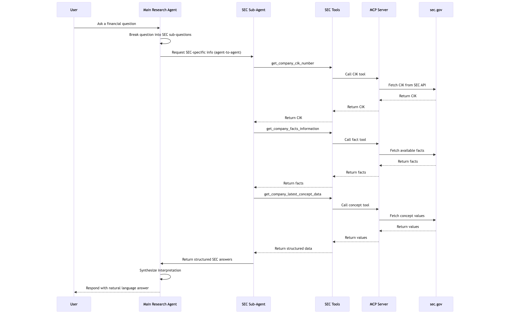

# FinSight
Your intelligent companion for financial research — precise insights from SEC filings at your fingertips

---

**FinSight** is an AI-powered financial research agent that helps users explore public company performance using official SEC filings. Powered by a multi-agent system, it translates complex questions into structured sub-queries and delivers fact-based insights using real-time data from the [SEC EDGAR XBRL API](https://www.sec.gov/edgar/sec-api-documentation).

---

## 🚀 Key Features

- 🔍 **Natural Language Financial Research**  
  Ask high-level questions like:  
  _“Are there signs of financial distress in Nvidia?”_ or  
  _“Is Apple increasing its investment in R&D?”_

- 🧠 **Multi-Agent Architecture**  
  - **Main Research Agent** understands intent, decomposes questions, and orchestrates sub-tasks.
  - **SEC Filings Expert** agent handles structured queries using SEC’s XBRL database.

- 🧰 **Built-In Tools**
  - `get_company_cik_number`: Lookup CIK from company name.
  - `get_company_facts_information`: List relevant financial facts available for a company based on keyword search.
  - `get_available_frames_in_fiscial_year`: Retrieve reported frames for a fiscial year.
  - `get_data_for_frame`: Retrieve data for a specific frame.

- 🔗 **Data Source**  
  Live integration with the SEC’s public [XBRL company concept API](https://data.sec.gov/api/xbrl/companyconcept/).

- 📖 **Explainable Results**  
  Each response includes specific fiscal year, form type (10-K/10-Q), and filing dates.

---

## 🧠 How It Works



---
## Architecture Diagram

The system consists of:

- **SecAgent (A2A Service)**: A worer agent for information retrieval from US SEC.gov. This agent is powered by the SEC EDGAR MCP Server Tools .
- **HostAgent (A2A Service)**: A coordinator agent that breaks the complex user questions into information retreiving questions.
- **Streamlit UIs**: 
  - **Embedded Runner UI**: The UI runs the HostAgent in the same process.



---

## 💼 Example Questions You Can Ask

- “What is Nvidia’s free cash flow trend?”
- “Does Apple show signs of financial distress?”
- “How has Tesla’s R&D investment changed in the last 5 years?”
- “What is the most recent earnings per share reported by Amazon?”

---

## 📁 Project Structure

```
📦 
├─ .DS_Store
├─ .gitignore
├─ .vscode
│  └─ settings.json
├─ FinSIght_arch.png
├─ LICENSE
├─ README.md
├─ finsight_agent
│  ├─ README.md
│  ├─ config.py
│  ├─ host_agent
│  │  ├─ __init__.py
│  │  ├─ agent.py
│  │  ├─ prompt.py
│  │  ├─ remote_connections.py
│  │  └─ tools.py
│  ├─ requirements.txt
│  ├─ scripts
│  │  └─ start_agent.py
│  ├─ sec_agent
│  │  ├─ __init__.py
│  │  ├─ __main__.py
│  │  ├─ agent.py
│  │  ├─ agent_executor.py
│  │  ├─ prompt.py
│  │  └─ test_client.py
│  ├─ ui
│  │  └─ app.py
│  └─ utils
│     └─ custom_adk_patches.py
├─ finsight_sequence.png
└─ mcp_server
   ├─ README.md
   └─ sec_edgar_server
      ├─ .python-version
      ├─ README.md
      ├─ main.py
      ├─ pyproject.toml
      ├─ requirements.txt
      └─ uv.lock
```

---

## Running the Full System

This is the recommended way to run the entire multi-agent system.

1.  **Start all agent services**:
    A convenience script is provided to launch the Sec agent in the background. The logs will be saved to the `logs/` directory.

    ```bash
    python scripts/start_agents.py
    ```

    You can check the status of the agents with `ps aux | grep _agent`.

2.  **Run a UI Application**:

    - **For the Embedded Runner UI:**
      ```bash
      streamlit run ui/app.py --server.port 8080
      ```

3.  **Stopping the services**:
    You can stop the background agent processes with:
    ```bash
    pkill -f "_agent"
    ```

## Testing Individual Agents (Standalone)

For development and debugging, it's crucial to test each agent independently. Each agent has a `test_client.py` that communicates directly with its A2A service.

1.  **Start the target agent's service**. For example, to test the Notion agent:

    ```bash
    python -m sec_agent --port 8002
    ```

2.  **In a separate terminal, run its test client**:

    ```bash
    python sec_agent/test_client.py
    ```


---

## 📦 Tech Stack

- 🧩 **Google ADK**
- 🧠 **Gemini LLMs**
- 📄 **SEC XBRL API** (`data.sec.gov`)
- 🔌 **Multi-agent orchestration**
- 📜 **Python async, logging, environment-driven config**

---

## 📈 Future Improvements

- Add support for multi-company comparisons
- Integrate with vector database for long-form filing summarization
- Include industry benchmarks for richer insights
- Stream responses in real-time via web UI or chat interface

---

## 🛡️ Disclaimer

FinSight retrieves only **public data from the SEC** and does not provide investment advice or trading recommendations.

---

## 🧑‍💻 Author

**Sai Rohit Uddagiri**  
Data Engineer & AI Agent Developer  
[LinkedIn](https://www.linkedin.com/in/sairohituddagiri/) | [GitHub](https://github.com/Rohituddagiri)
